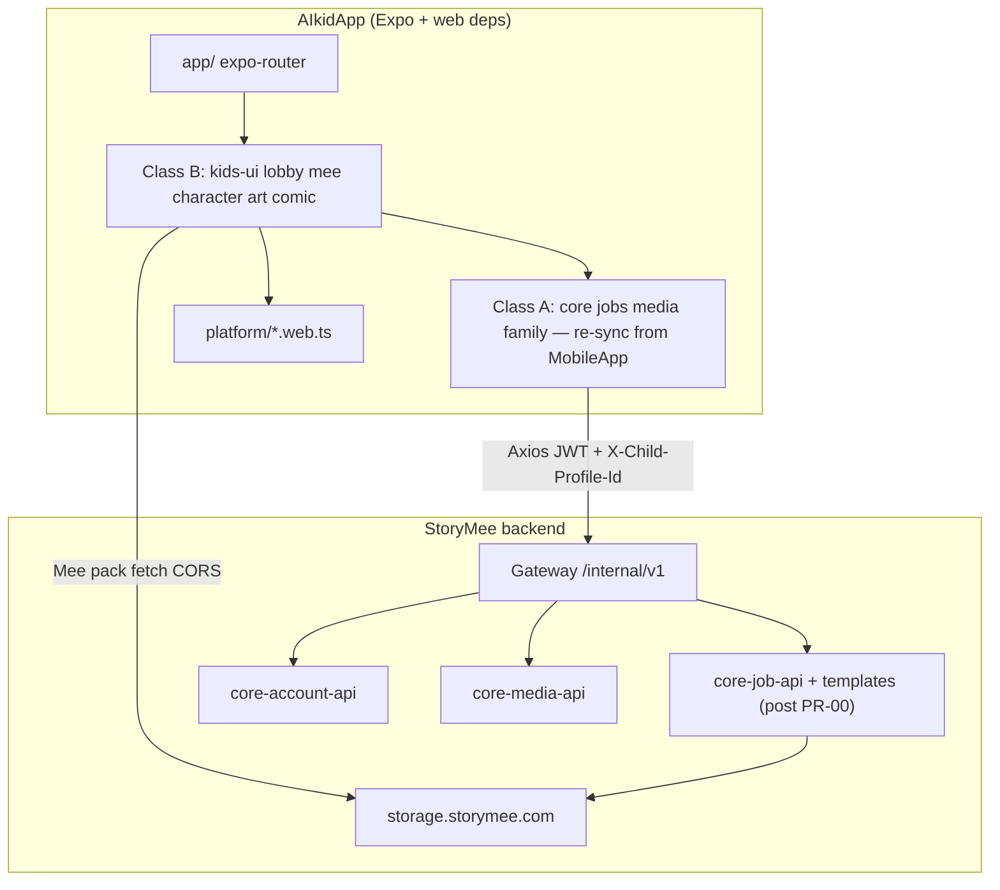
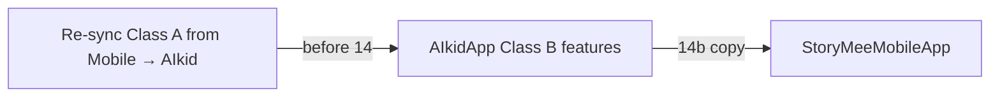
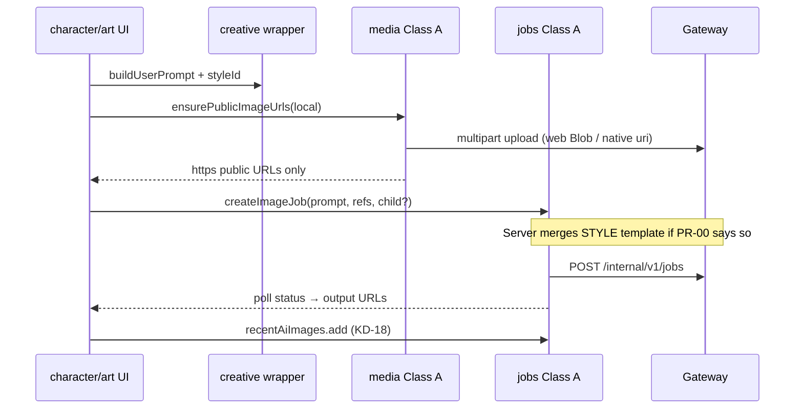
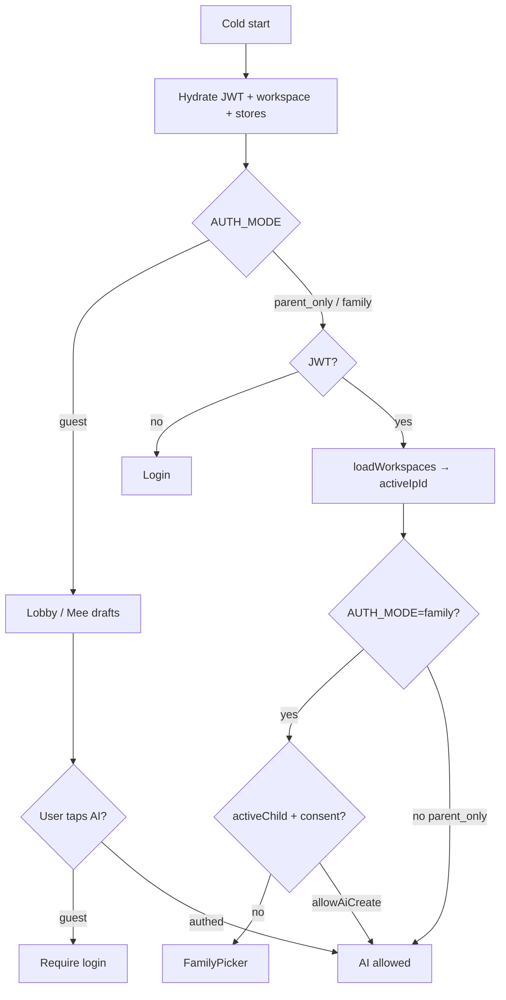

# AIkid / Xưởng Sáng Tạo — Feature-Modular Refactor Plan

| Field | Value |
|-------|--------|
| **Document** | `DESIGN_AIKID_FEATURE_REFACTOR.md` |
| **Author** | TBD (StoryMee eng) |
| **Date** | 2026-07-17 |
| **Status** | Draft (rev 2 — post design review) |
| **Audience** | Senior engineers — StoryMee Mobile + Creative |
| **Related SSOT** | `StoryMeeMobileApp/docs/APP_ARCHITECTURE.md`, monorepo `00-Ecosystem-Docs/` |

---

## Overview

**AIkid** (product surface: kids creative universe / Xưởng Sáng Tạo) is currently a **vanilla multi-HTML prototype** (~865MB, ~**1.3k** SVG assets, multi-thousand-LOC inline pages) served by a Node static server with an ad-hoc `POST /api/generate-image` that holds Gemini/OpenAI keys server-side. It cannot merge cleanly into **StoryMeeMobileApp** (Expo SDK 54, expo-router, Zustand, TanStack Query, Gateway-only HTTP, Family parent/child model).

This design proposes building a **new feature-modular Expo app** under `1-Harness-Apps/xuong-sang-tao/AIkidApp` that **mirrors** StoryMeeMobileApp’s `app/` + `src/core` + `src/features/*` layout, then integrating creative features into StoryMeeMobileApp via **staged merge PRs** (not a single big-bang). Screens are thin expo-router routes; domain logic lives in features. Heavy web-only capabilities (SVG layer recolor + compose, freehand canvas) are isolated behind platform modules. AI generation moves from local Node keys to **Gateway jobs** only after a **verified backend contract spike**; shared `jobs`/`media`/`core` modules are **Class A** (no long-lived forks). Mee layer packs leave the app binary for **CDN/R2 + versioned nested manifests** (evolve of `SVG/build.js`, not a one-line tweak).

---

## Background & Motivation

### Current state (AIkid prototype)

| Area | Path | Notes |
|------|------|--------|
| Lobby + login | `AIkid/new-lobby-page/` | Multi-page HTML, shared CSS, client-only “login” |
| Character AI | `new-lobby-page/character/*` | `generate.html` ~2850 LOC; form → feature → storage |
| Art / canvas | `new-lobby-page/art/*` | Style pick → canvas ~2059 LOC → comic |
| Mee creator | `AIkid/SVG/` | `app.js` ~2497 LOC, `assets.js` ~4.7MB inlined SVGs |
| Legacy fork | `AIkid/kids-creative-app/` | Older Mee (~58MB); **do not ship as second app** |
| Server | `new-lobby-page/server.js` | Static + `POST /api/generate-image` (Gemini/OpenAI) |

**Lobby cards today:** `/mee`, `/character`, `/art` (+ `/login`). Desktop scaler layout: **1927.63 × 930** px.

**Pain points:**

1. **No module boundaries** — logic, markup, and styling colocated in giant HTML files.
2. **No shared identity** with MobileApp — no parent JWT, no child profile, no consent gates.
3. **Secrets model is prototype-only** — keys in local `.env` on Node; style prompts on server are good, path is not Gateway.
4. **State is ad-hoc localStorage** — large base64 PNG blobs (`mee_character_png`) blow quota.
5. **Asset bloat** — SVG folder ~284MB; `assets.js` ~4.7MB; ~**1300** SVG files; cannot ship in mobile binary.
6. **Duplication** — `kids-creative-app` vs `SVG/` Mee forks.
7. **Merge risk** — page-folder structure does not map to MobileApp feature modules.
8. **AI parity risk** — prototype character gen is not “prompt-only”: server merges large `STYLE_PROMPT` + `NEGATIVE_PROMPT`; art is vision-describe-then-redraw. MobileApp jobs today only pass user `prompt` + optional `reference_image_urls`.

### Target partner (StoryMeeMobileApp)

```
app/          # expo-router screens only
src/core/     # api, auth, legal, settings, workspace, ui, query
src/features/ # account, family, jobs, media
```

Identity: **Parent JWT** + **Child profiles** (`ageBand ∈ {9-12, 13-15}`), header `X-Child-Profile-Id`, Gateway base `EXPO_PUBLIC_API_URL` → `/internal/v1/...`. Legal brand host: `aikids.storymee.com`. JWT web fallback already exists in MobileApp `src/core/auth/token.ts` (SecureStore → localStorage on web).

### Why refactor now

- Product wants one kids creative universe that can later appear inside the family-managed mobile app.
- Prototype has validated UX flows worth preserving.
- Clean feature boundaries now cost less than a big-bang rewrite during merge.

---

## Goals & Non-Goals

### Goals

1. **Feature-modular** structure aligned 1:1 with StoryMeeMobileApp conventions.
2. **Expo-first** (SDK 54) with **explicit web deps** for AIkidApp; web-first Mee/canvas; native policy decided before MobileApp merge.
3. **Interim app** under `xuong-sang-tao/AIkidApp`; **staged merge** of creative-only modules into MobileApp.
4. **Typed state** replacing localStorage (Zustand + AsyncStorage; SecureStore/localStorage JWT).
5. **AI via Gateway jobs** after backend contract verification; no client provider keys.
6. **CDN-backed Mee packs** with nested manifests matching real `meeAssets` topology.
7. **Archive** `kids-creative-app/`; single Mee source from `SVG/`.
8. **Incremental PR plan** including **PR-00 backend spike**, split jobs port vs AI wire-up, split merge PRs.
9. **Kids-safe security**: AI requires parent JWT; family consent when `AUTH_MODE=family`.

### Non-Goals (this phase)

- Implementing production code (design only).
- Redesigning visual brand beyond modularization.
- Full comic editor (hub only).
- Migrating production user data (none).
- Claiming job-api already supports AIkid templates without PR-00 proof.
- Age band **5–8**.
- Long-lived fork of MobileApp `jobHooks.ts` / `mediaHooks.ts`.

---

## Key Decisions

| ID | Decision | Rationale |
|----|----------|-----------|
| **KD-1** | Build **new Expo app** `xuong-sang-tao/AIkidApp` first; staged merge into StoryMeeMobileApp later | Keeps MobileApp store-stable; forces merge-ready structure |
| **KD-2** | Stack parity: **Expo SDK 54, expo-router, NativeWind v4, Zustand, TanStack Query, Axios → Gateway only**. AIkidApp **must declare Expo web deps** (`react-dom`, `react-native-web`, etc. via Expo web template) in PR-01 | MobileApp `package.json` has `"web"` script but no direct web deps today — web parity is real only if AIkidApp adds them |
| **KD-3** | Feature folders by **domain**, not HTML page | `character` owns generate+feature+storage; `comic` split from `/art/comic` |
| **KD-4** | Platform isolation: `src/features/mee|art/platform/` + `*.web.ts` / `*.native.ts` | DOM compose/canvas; native policy in KD-15 |
| **KD-5** | AI: **Gateway jobs only after PR-00 contract spike**. Client never ships system STYLE/NEGATIVE prompts. Prefer job-api **server templates** (`aikid.character.v1`, art style map). If templates/vision not ready → **interim BFF PR** (Gateway-auth, no client keys, feature-flag kill). PR-09 acceptance = **visual constraint parity** with prototype STYLE_PROMPT, not merely “job completes” | Prototype AI ≠ MobileApp Create path |
| **KD-6** | Mee assets: **CDN pack + nested manifest**; prefer **base SVG + client recolor** over shipping all pre-colored hair/eye variants | Matches compose pipeline; cuts pack size vs ~693 hair SVGs |
| **KD-7** | Archive `kids-creative-app/` → `AIkid/_archive/`; single Mee from `SVG/` | Avoid dual forks |
| **KD-8** | **AI always requires authenticated parent JWT + hydrated workspace `ipId`**. Guest may play lobby/Mee offline drafts only. Interim AI mode: **`parent_only`** (omit `child_profile_id` only if PR-00 proves job-api accepts it) OR **`family`** (preferred for production demos). Default until PR-00: **block AI without JWT; prefer family for any shared/staging AI** | Avoid second identity path that dies at merge |
| **KD-9** | Kids chrome lives in **`src/features/kids-ui` only** (not `core/ui/kids`). Shared primitives stay in `src/core/ui` | Stops placement churn at merge |
| **KD-10** | Storage keys interim: `aikid.<feature>.v1.*`. At merge: dual-read `aikid.*` → write `storymee.creative.*` once | Continuity for web demo users |
| **KD-11** | Product label AIkid Universe; legal `aikids.storymee.com` | Matches MobileApp legal |
| **KD-12** | Module classes: **(A) shared infra** = `core/*`, `jobs`, `media`, `family`, `account` — **copy from MobileApp, re-sync periodically, extend only via thin wrappers in creative features**; **(B) creative-only** = free invent. **Forbid** long-lived forks of `jobHooks.ts` / `mediaHooks.ts` | Prevents merge loss of upload/job helpers |
| **KD-13** | **CDN host of record (default until ops confirms):** public objects under **`https://storage.storymee.com/...`** (same host MobileApp already uses for `sb://` resolve). Do **not** invent `cdn.storymee.com` until DNS/bucket ownership is confirmed. Env: `EXPO_PUBLIC_MEE_PACK_BASE_URL` | Verified pattern: `resolveMediaUri` → `storage.storymee.com` |
| **KD-14** | **STYLE_PROMPT / NEGATIVE_PROMPT live only server-side** (job-api template or interim BFF). Client sends **user text** + **style id** + **reference HTTPS URLs** only | Security + parity |
| **KD-15** | **Native Mee/art v1 (default):** hide Mee creator + freehand canvas on iOS/Android (`Platform.OS !== 'web'`); show “Mở trên web” / deep-link. Optional WebView is phase-2 experiment only | Avoid shipping broken store routes |
| **KD-16** | **AIkidApp store listing (default):** **not store-listed**; harness/web demo only until product chooses Alt E deep-link host or full native parity | Open Q9 default |
| **KD-17** | **MobileApp creative IA (default until product overrides):** entry from **Profile → “Xưởng Sáng Tạo”** (or lobby route), **not** a 4th tab; routes behind `EXPO_PUBLIC_CREATIVE_UNIVERSE=1` | Avoid tab overcrowding; unblocks merge shell without tab redesign |
| **KD-18** | Creative AI outputs: also **append to `useRecentAiImages`** (child-scoped when family) **and** keep domain lists (`SavedCharacter`, art session). Dual index intentional | Gallery “Ảnh AI” parity |

---

## Proposed Design

### 1. Target platform

| Capability | Web (AIkidApp) | iOS/Android AIkidApp | StoryMeeMobileApp after merge |
|------------|----------------|----------------------|-------------------------------|
| Lobby, forms, storage list, style pick, comic hub | ✅ | ✅ | ✅ |
| Mee SVG compose + PNG export | ✅ primary | ❌ hidden (KD-15) | ❌ hidden until native plan |
| Art freehand canvas + redraw | ✅ primary | ❌ hidden (KD-15) | ❌ hidden until native plan |
| AI image (character + art) | ✅ if JWT+ipId | ✅ if JWT+ipId | ✅ + family consent |
| Family parent/child | optional → family | same | required |



### 2. Module classification (Class A vs B)

| Class | Modules | Ownership rule |
|-------|---------|----------------|
| **A — shared infra** | `src/core/**`, `src/features/jobs`, `src/features/media`, `src/features/family`, `src/features/account` | **Source of truth = StoryMeeMobileApp**. AIkidApp copies; schedule **re-sync PRs** before merge. Creative features may add **wrappers** under `character/api/` or `art/api/` that call Class A — never edit Class A for creative-only concerns if it would diverge from MobileApp without upstreaming. |
| **B — creative-only** | `kids-ui`, `lobby`, `mee`, `character`, `art`, `comic` | Invent freely in AIkidApp; merge copies these into MobileApp. |

**Upstream rule:** If character/art need `ensurePublicImageUrls` or job payload helpers used by generator too → **upstream into MobileApp `media`/`jobs` first**, then re-copy to AIkidApp.

### 3. Repository layout

#### 3.1 Interim tree

```
1-Harness-Apps/xuong-sang-tao/
├── docs/DESIGN_AIKID_FEATURE_REFACTOR.md
├── AIkid/                          # prototype reference + pack source
│   ├── new-lobby-page/
│   ├── SVG/                        # pack pipeline input
│   └── _archive/kids-creative-app/
└── AIkidApp/                       # NEW Expo app
    ├── app/
    │   ├── _layout.tsx
    │   ├── index.tsx
    │   ├── (auth)/login.tsx | register.tsx
    │   └── (app)/
    │       ├── _layout.tsx         # AUTH_MODE gate
    │       ├── lobby.tsx
    │       ├── family/...          # when family mode
    │       ├── mee/index.tsx | next.tsx
    │       ├── character/...
    │       ├── art/...
    │       └── comic/index.tsx
    ├── src/
    │   ├── core/                   # Class A — copy MobileApp
    │   └── features/
    │       ├── kids-ui/            # Class B — KD-9 locked here
    │       ├── lobby/ mee/ character/ art/ comic/   # Class B
    │       ├── jobs/ media/ family/ account/        # Class A
    ├── scripts/build-mee-pack.mjs
    ├── fixtures/mee-pack-dev/      # tiny subset for CI
    ├── package.json                # includes Expo web deps
    └── .env.example
```

#### 3.2 Feature internal shape

```
src/features/<name>/
├── api/
├── hooks/
├── store/
├── components/
├── platform/          # optional
├── constants.ts
├── types.ts
└── index.ts
```

#### 3.3 Final MobileApp integration (staged)

Not one PR — see PR-14a–14d. Copy **Class B** only after Class A re-sync. Storage dual-read rename in 14c. IA entry KD-17 in 14d.



### 4. Feature boundaries

| Feature | Class | Owns | Does not own |
|---------|-------|------|--------------|
| **kids-ui** | B | Meteor loader, lobby cards, fonts, pop SFX | Business state |
| **lobby** | B | Home destinations | Auth |
| **account/auth** | A | Login/register JWT | Child profiles |
| **family** | A | Children, active child, consent | Creative drafts |
| **mee** | B | Pack load, draft, compose, export | AI jobs |
| **character** | B | Category form, generate UX, saved list, **prompt builder** | Class A job client |
| **art** | B | Style catalog, canvas, redraw UX | Class A upload/job |
| **comic** | B | Hub only | Full editor |
| **jobs** | A | create/poll image jobs, recent AI | Creative prompts |
| **media** | A | upload, resolveMediaUri, ensurePublicImageUrls | Canvas UI |

#### Cross-feature sequence (target, post-contract)



### 5. Route map (HTML → expo-router)

| Old path | Old file | New route | Group |
|----------|----------|-----------|--------|
| `/login` | `login.html` | `/(auth)/login` | auth |
| register link | login.html | `/(auth)/register` | auth |
| `/` | `index.html` | `/(app)/lobby` | app |
| `/character` | `character.html` | `/(app)/character` | app |
| `/character/generate` | `generate.html` | `/(app)/character/generate` | app |
| `/character/generate/feature` | `feature.html` | `/(app)/character/feature` | app |
| `/character/generate/feature-next` | `feature-next.html` | `/(app)/character/feature-next` | app |
| `/character/storage` | `storage.html` | `/(app)/character/storage` | app |
| `/mee` | `SVG/index.html` | `/(app)/mee` | app (web) |
| `/mee/next` | `next.html` | `/(app)/mee/next` | app (web) |
| `/art` | `art/index.html` | `/(app)/art` | app |
| `/art/style` | `style.html` | `/(app)/art/style` | app |
| `/art/image-generate` | `image-generate.html` | `/(app)/art/image-generate` | app (web canvas) |
| `/art/comic` | `comic.html` | `/(app)/comic` | app |

Deep-link aliases during transition: `/mee/*`, `/art/comic` → new paths.

#### Auth / AI gates



### 6. Backend contract & AI API strategy

#### 6.1 Prototype behavior (source of truth for parity)

**Character generate** (`server.js` `generateImageFromAPI`):

- Client sends **user prompt** (and optional `existingImage` data-URL).
- Server builds: `userPrompt + STYLE REQUIREMENTS: {STYLE_PROMPT} + AVOID: {NEGATIVE_PROMPT}`.
- Provider: Gemini image model or OpenAI DALL-E via env keys.

**Art redraw** (`redrawUserDrawing`):

1. Vision describe drawing (Gemini/OpenAI vision).
2. `userPrompt = Redraw this children's drawing: {description}. The drawing style selected is {styleName}.`
3. Then same `generateImageFromAPI` (includes STYLE_PROMPT again).

MobileApp today (`jobHooks.ts`):

```ts
// Actual CreateImageJobInput fields only:
{ prompt, provider?, ipId?, referenceImageUrls?, childProfileId? }
// POST body:
{ jobType: 'image', ipId, inputParams: {
    prompt, provider,
    reference_image_urls?, reference_image_url?, image_url?,
    child_profile_id?
}}
```

**Unverified today:** whether job-api merges any system style, honors unknown `inputParams` keys, or supports vision-then-redraw. **Do not implement PR-09/PR-10 against hope.**

#### 6.2 PR-00 — Backend / contract spike (blocking)

**Owner:** platform eng (job-api) + creative eng co-sign.  
**Deliverable:** short RFC appendix in this doc or `docs/BACKEND_CONTRACT_AIKID.md` with:

| Check | Method | Pass criteria |
|-------|--------|---------------|
| Current image job `inputParams` schema | Read job-api + 1 live create against dev-hub | Documented field list |
| Null `child_profile_id` allowed? | Create job with parent JWT only | yes/no + error body |
| Template injection? | Compare output of raw prompt vs styled | Document |
| Vision redraw | Try ref image + prompt only | Document gap |
| Rate limits / auth | 401 without JWT | Confirmed |

**Decision tree (must pick one path before PR-09):**

| Path | When | Client sends | Server does |
|------|------|--------------|-------------|
| **P1 Template** (preferred) | job-api can add templates | `prompt` (user only), `provider`, refs, optional `template_id: 'aikid.character.v1'`, `art_style_id` | Merge STYLE/NEGATIVE or art style text server-side |
| **P2 Client-enriched user prompt** (fallback if templates slip) | only for staging | Longer **user** prompt that *approximates* look **without** claiming security of server system prompt | Still no secrets; **parity will be weaker** — must label UX “approx style” |
| **P3 Interim BFF** | vision pipeline or keys only on harness | Same as MobileApp job client OR call BFF | BFF: Gateway JWT validate → vision → template merge → provider or enqueue job |

**P3 Interim BFF requirements (if chosen):**

| Item | Spec |
|------|------|
| Host | Harness-only service behind same Gateway auth **or** path on hub not exposed without JWT |
| Auth | Require `Authorization: Bearer` parent JWT; reject guest |
| Keys | Server env only (`GEMINI_*` / provider) — never Expo `EXPO_PUBLIC_*` |
| Routes | e.g. `POST /internal/v1/creative/generate-character`, `POST .../redraw-drawing` **or** non-gateway harness URL documented in `.env.example` as temporary |
| Kill switch | `EXPO_PUBLIC_CREATIVE_AI_TRANSPORT=gateway_jobs\|bff` |
| Deprecation | Delete when P1 lands; PR removes BFF client branch |
| PR slot | **PR-00b** after PR-00 spike chooses P3 |

**PR-09 acceptance criteria (character):**

1. Side-by-side fixture: same user prompt → output satisfies “single character, white bg, no multi-view” constraints comparable to prototype STYLE_PROMPT (human review checklist).
2. No provider API key in client bundle (grep CI).
3. Job or BFF payload snapshot test (redacted).
4. Requires JWT + `ipId` (identity matrix).

**PR-10 acceptance (art):** vision-quality redraw **or** documented degraded path (upload drawing as ref + style id) approved by design if vision unavailable.

#### 6.3 Media reference pipeline (Class A + web)

Port and **upstream** MobileApp patterns from `generator.tsx` `pickUploadPublicUrl` + `mediaHooks.resolveMediaUri` + `uploadMedia`.

```ts
// Target shared helper — prefer landing in features/media/api/
export async function ensurePublicImageUrls(
  locals: Array<{ uri: string; fileName?: string; mimeType?: string } | Blob | File>,
): Promise<string[]> {
  // 1) For each local:
  //    - web: Blob/File → FormData.append('file', blob, fileName)
  //    - native: FormData append { uri, name, type } as today
  //    - data-URL: if > 1.5MB reject or compress; convert to Blob on web
  // 2) POST /internal/v1/media/upload with ipId first (fastify-multipart order)
  // 3) pickUploadPublicUrl(result) → resolveMediaUri
  // 4) Assert final URL is https:// (or http localhost dev only)
  // 5) NEVER pass sb:// to job reference_image_urls — resolve first
}
```

| Rule | Detail |
|------|--------|
| Provider refs | **HTTPS only** after `resolveMediaUri` |
| `sb://` | Display OK via resolve; **not** raw in `reference_image_urls` unless job-api documents resolution (assume **no**) |
| Web FormData | Real `Blob`/`File`, not RN `{uri,name,type}` alone |
| Tests | PR-09: unit test pickUploadPublicUrl shapes; integration mock upload on web |

#### 6.4 Identity matrix for AI

| AUTH_MODE | Lobby/Mee drafts | AI generate | ipId source | child_profile_id | consent |
|-----------|------------------|-------------|-------------|------------------|---------|
| `guest` | yes | **no** | n/a | n/a | n/a |
| `parent_only` | yes if JWT | yes if JWT + workspace | `GET /account/workspaces` + `getActiveIpId()` / `EXPO_PUBLIC_DEFAULT_IP_ID` fallback | omit / null **only if PR-00 proves OK** | n/a |
| `family` | yes if JWT | yes if `allowAiCreate` | same | **required** + header `X-Child-Profile-Id` | enforce `allowAiCreate` / `allowPhoto` |

**Default for shared staging demos:** `family` once family screens land (PR-12). Until then, AI buttons show login/family CTA — **do not** ship guest AI.

`getActiveIpId()` already falls back to `getDefaultIpId()` in MobileApp workspace store — hydrate workspaces after login the same way.

#### 6.5 Client job call shape (after PR-00)

```ts
// Creative wrapper — does NOT fork jobHooks; composes Class A
async function createCreativeImageJob(opts: {
  userPrompt: string;           // never full STYLE_PROMPT
  provider?: string;
  referenceImageUrls?: string[]; // https only
  childProfileId?: string;
  templateId?: string;          // if P1
  artStyleId?: string;          // if P1
}) {
  // If P1: pass template_id / art_style_id only if PR-00 confirmed job-api reads them
  // If P2: userPrompt already enriched (weaker)
  // If P3: call BFF instead of createImageJob
  return createImageJob({ /* Class A API only */ });
}
```

Unknown `inputParams` must **not** be assumed to change model behavior until PR-00 greenlights them.

---

### 7. State migration

#### 7.1 Legacy localStorage inventory

| Legacy key | Domain |
|------------|--------|
| `mee_character_state` | mee draft JSON |
| `mee_character_png` | large data-URL — **do not re-persist as primary** |
| `mee_character_customizer_state` | archive only |
| `storymee_char_*` | character meta fields |
| `storymee_generated_character_img` / `storymee_uploaded_image` | images |
| `storymee_generate_inputs` / `category_inputs` / `active_category` | form |
| `storymee_saved_characters` | storage list |
| `storymee_storage_cleared_v11` | seed flag |
| `storymee_selected_style` | art style **label** (Vietnamese string) |
| `storymee_canvas_draw` | canvas data-URL |

#### 7.2 MeeDraft

```ts
export type MeeGender = 'male' | 'female';
export type MeeDraft = {
  schemaVersion: 1;
  gender: MeeGender;
  skinTone: number; // 1–10
  face: number;
  eyes: number;
  eyesColor: number;
  eyebrows: number;
  eyebrowsColorIndex: number;
  syncEyebrowsColor: boolean;
  nose: number;
  mouth: number;
  bang: number;
  behind: number;
  hairColor: number;
  customPrimaryColor: string | null;
  customShadowColor: string | null;
  shirt: number; pants: number; dress: number;
  shirtColor: number; pantsColor: number;
  backgroundColor: string;
  backgroundType: 'light' | 'dark' | 'grid' | 'gingham' | 'upload';
  backgroundImageUrl?: string;
  packVersion: string;
};
// Non-persisted runtime: recoloredEars cache (from app.js)
```

Keys: `aikid.mee.draft.v1` (+ `.child.${id}` in family mode). Export PNG → FileSystem/IndexedDB or upload → URI only.

#### 7.3 Character form schema (from `generate.html`)

**Categories** (dropdown values): `shape` | `parts` | `face` | `hair` | `clothes`  
(Note: older markup had a `color` wrapper; **live categoryQuestions has no separate color category** — color lives inside shape/hair questions.)

```ts
export type CharacterCategoryId =
  | 'shape' | 'parts' | 'face' | 'hair' | 'clothes';

export type CategoryQuestionDef = {
  label: string;
  subject: string;
  choices: string[];
  placeholder: string;
};

/** Fixed catalog — port exactly from generate.html categoryQuestions */
export const CATEGORY_QUESTIONS: Record<CharacterCategoryId, CategoryQuestionDef[]> = {
  shape: [
    { label: '1. NHÂN VẬT CỦA EM LÀ GÌ?', subject: 'Nhân vật', choices: ['con người','con vật','đồ vật','thực vật','robot'], placeholder: 'Ví dụ: con mèo, con gấu, siêu nhân...' },
    { label: '2. NHÂN VẬT CÓ DÁNG NGƯỜI THẾ NÀO?', subject: 'Dáng người', choices: ['tròn trịa','mảnh mai','nhỏ bé','cao lớn','mũm mĩm','vuông vức','tam giác'], placeholder: '...' },
    { label: '3. NHÂN VẬT CÓ DA MÀU GÌ?', subject: 'Màu da', choices: ['trắng hồng','nâu bánh mật','rám nắng','xanh lá cây','xám sáng'], placeholder: '...' },
    { label: '4. CHẤT LIỆU CỦA NHÂN VẬT LÀ GÌ?', subject: 'Chất liệu', choices: ['da mềm','lông','vải bông','kim loại','gỗ','thủy tinh'], placeholder: '...' },
    { label: '5. NHÂN VẬT CÓ HỌA TIẾT GÌ TRÊN CƠ THỂ?', subject: 'Họa tiết', choices: ['không có họa tiết','sọc vằn tinh nghịch','đốm tròn đáng yêu'], placeholder: '...' },
    { label: '6. TỔNG THỂ NHÂN VẬT TẠO CẢM GIÁC GÌ?', subject: 'Cảm giác', choices: ['đáng yêu','vui nhộn','mạnh mẽ','bí ẩn','ngốc nghếch','kỳ lạ','độc ác'], placeholder: '...' },
  ],
  parts: [ /* 5 questions — tay, chân, cánh, đuôi, sừng — see generate.html:1989-1994 */ ],
  face: [ /* 6 questions — mắt, miệng, mũi, tai, điểm đặc biệt, biểu cảm */ ],
  hair: [ /* 6 questions — kiểu, mái, màu, độ dài, đặc biệt, phụ kiện đầu */ ],
  clothes: [ /* 4 questions — áo, quần/váy, giày, phụ kiện */ ],
};

/** Per-category answers: index-aligned to CATEGORY_QUESTIONS[cat] */
export type CategoryAnswers = Record<CharacterCategoryId, string[]>;

export type CharacterDraft = {
  schemaVersion: 1;
  name: string;
  age: string;
  gender: string;
  birthday: string;
  species: string;
  description: string;
  activeCategory: CharacterCategoryId;
  categoryInputs: CategoryAnswers;
  /** Freeform idea boxes outside category grid if still used */
  ideaNotes?: { shape?: string };
  uploadedImageUri: string | null;
  generatedImageUri: string | null;
  updatedAt: string;
};

export type SavedCharacter = {
  id: string;
  name: string;
  age?: string;
  gender?: string;
  species?: string;
  description?: string;
  birthday?: string;
  avatarUri: string;
  profileImgUri?: string;
  fullbodyImgUri?: string;
  source: 'ai' | 'mee' | 'seed';
  childProfileId?: string | null;
  createdAt: string;
};
```

Full choice lists for parts/face/hair/clothes: copy verbatim from `AIkid/new-lobby-page/character/generate.html` lines ~1988–2015 into `character/constants.ts` during PR-08 (design requires **no** loose `Record<string, unknown>` for known fields).

**Prompt builder:** concatenate non-empty answers with their `subject` labels (same as prototype collect loop ~2505+) → `userPrompt` string only.

#### 7.4 Art style catalog (from `style.html` + PNG assets)

| id | label_vi | thumbnail file (legacy) | server template key (proposed) |
|----|----------|-------------------------|--------------------------------|
| `watercolor` | Màu Nước | art-style-watercolor.jpeg | `aikid.art.watercolor` |
| `cartoon` | Hoạt Hình | art-style-cartoon.jpeg | `aikid.art.cartoon` |
| `crayon` | Bút Sáp | art-style-crayon.jpeg | `aikid.art.crayon` |
| `anime` | Anime | art-style-anime.jpeg | `aikid.art.anime` |
| `manga` | Manga | art-style-manga.jpeg | `aikid.art.manga` |
| `comic` | Truyện Tranh | art-style-comic.jpeg | `aikid.art.comic` |
| `sketch` | Tranh Chì | art-style-sketch.jpeg | `aikid.art.sketch` |
| `3d` | 3D | art-style-3D.jpeg | `aikid.art.3d` |
| `pixel` | Pixel | art-style-pixel.jpeg | `aikid.art.pixel` |
| `chibi` | Chibi | art-style-chibi.jpeg | `aikid.art.chibi` |
| `clay` | Đất Sét | art-style-clay.jpeg | `aikid.art.clay` |
| `fabric` | Vải Nỉ | art-style-farbic.jpeg (typo preserved in asset name) | `aikid.art.fabric` |
| `manhwa` | Manhwa | art-style-manhwa.jpeg | `aikid.art.manhwa` |
| `semirealistic` | Bán Tả Thực | art-style-semirealistic.jpeg | `aikid.art.semirealistic` |

```ts
export type ArtStyleId =
  | 'watercolor' | 'cartoon' | 'crayon' | 'anime' | 'manga' | 'comic'
  | 'sketch' | '3d' | 'pixel' | 'chibi' | 'clay' | 'fabric'
  | 'manhwa' | 'semirealistic';

export const ART_STYLES: { id: ArtStyleId; labelVi: string; thumb: string; templateKey: string }[] = [
  /* table above */
];

export type ArtSession = {
  schemaVersion: 1;
  styleId: ArtStyleId;
  styleLabel: string; // Vietnamese display
  canvasUri: string | null;
  lastResultUri: string | null;
  updatedAt: string;
};
```

Migration: map legacy `storymee_selected_style` **label** → id via `labelVi` lookup.

#### 7.5 Merge storage dual-read

```ts
// On hydrate after merge:
// 1) try storymee.creative.mee.draft.v1
// 2) else aikid.mee.draft.v1 → write new key, keep old until next major
// Same for character/art keys
```

Creative job results: `useRecentAiImages.add` with tags `creative_surface: character|art` when possible (KD-18).

---

### 8. Assets strategy — nested Mee pack

#### 8.1 Facts

| Asset | Size |
|-------|------|
| AIkid total | ~865MB |
| SVG/ | ~284MB |
| assets.js | ~4.7MB |
| kids-creative-app | ~58MB |
| SVG file count | ~**1300** |
| Hair folder | ~693 SVGs (many precolored) |

#### 8.2 Real `meeAssets` topology (`build.js` / `assets.js`)

```
meeAssets
├── skinToneColors: { "1"…"10": { primary, shadow } }
├── body: { clothes|noClothes: { female|male: { skinIndex|default: svgString } } }
├── facial:
│   ├── ears, eyebrow, mouth, nose: { index: svg }
│   ├── eyes: { styleIndex: { colorIndex|default: svg } }  // precolored map
│   └── face: { styleIndex: { skinIndex: svg } }
├── hair: { bang|behind: { styleIndex: { colorIndex|default: svg } } }
└── outfit: {
      shirt|pants: { female|male: { index: svg } },
      dress: { female|male|unisex: { index: svg } }
    }
```

Flat `layers: Record<string, Record<string, {path}>>` is **insufficient**.

#### 8.3 Target manifest (nested)

```ts
export type PackSvgRef = {
  path: string;           // relative to baseUrl
  bytes?: number;
  sha256?: string;        // integrity
  etag?: string;
};

export type MeePackManifest = {
  version: string;        // "2026.07.1"
  baseUrl: string;        // https://storage.storymee.com/aikid/mee-packs/2026.07.1/
  colorStrategy: 'recolor_runtime' | 'precolored_files' | 'hybrid';
  palettes: {
    skinToneColors: Record<string, { primary: string; shadow: string }>;
    // hair/outfit/eyes palettes may live client-side (app.js hairColors) if recolor_runtime
  };
  body: {
    clothes: { female: Record<string, PackSvgRef>; male: Record<string, PackSvgRef> };
    // noClothes optional — compose currently prefers clothes body
  };
  facial: {
    ears: Record<string, PackSvgRef>;
    eyebrow: Record<string, PackSvgRef>;
    nose: Record<string, PackSvgRef>;
    mouth: Record<string, PackSvgRef>;
    eyes: Record<string, PackSvgRef | Record<string, PackSvgRef>>;
    face: Record<string, Record<string, PackSvgRef>>;
  };
  hair: {
    bang: Record<string, PackSvgRef | Record<string, PackSvgRef>>;
    behind: Record<string, PackSvgRef | Record<string, PackSvgRef>>;
  };
  outfit: {
    shirt: { female: Record<string, PackSvgRef>; male: Record<string, PackSvgRef> };
    pants: { female: Record<string, PackSvgRef>; male: Record<string, PackSvgRef> };
    dress: {
      female: Record<string, PackSvgRef>;
      male: Record<string, PackSvgRef>;
      unisex: Record<string, PackSvgRef>;
    };
  };
};
```

**Color strategy (default KD-6):** `recolor_runtime` — pack **base** SVGs (default/uncolored or single baseline color) + client recolor from `hairColors` / `outfitColors` / skinToneColors (as `app.js` already recolors eyebrows, skin, outfits). Drop redundant `*_Color N.svg` from CDN pack when recolor proven for that layer. **Hybrid** allowed for eyes if precolored maps are simpler initially.

#### 8.4 CDN / CORS / cache

| Topic | Spec |
|-------|------|
| Host default | `storage.storymee.com` (KD-13); confirm bucket path `aikid/mee-packs/` with ops |
| Public vs signed | **Public read** for pack SVGs (kids app needs browser fetch); write remains private |
| CORS | Allow Expo web origin(s) + localhost; `GET` + `HEAD`; expose `ETag` |
| Cache-Control | `public, max-age=86400, immutable` for versioned paths (version in URL) |
| Integrity | optional `sha256` in manifest; verify in dev/CI |
| Dev fixture | `AIkidApp/fixtures/mee-pack-dev/` — male skin1 body + 1 face + 1 eyes + 1 bang + 1 shirt — committed, < 500KB |
| PR-07 blocker | `.env.example` must include a **reachable** `EXPO_PUBLIC_MEE_PACK_BASE_URL` (dev fixture URL or local static) |

`build-mee-pack.mjs` is a **new product** evolving `build.js` (emit files + manifest, not only `assets.js`). Effort **L**.

#### 8.5 Lobby / art thumbs

Style thumbnails → same storage host `aikid/art-styles/`. Small lobby images may ship in app binary.

#### 8.6 Git policy

No bulk SVG in AIkidApp; pack source remains under `AIkid/SVG/`.

---

### 9. Platform modules & Mee compose port map

#### 9.1 Files

```
src/features/mee/platform/
  composeCharacter.ts           # pure types + orchestration
  composeCharacter.web.ts       # string compose port
  composeCharacter.native.ts    # returns { unsupported: true }
  exportPng.web.ts
  exportPng.native.ts
  sanitizeSvg.ts                # see Security
src/features/art/platform/
  DrawingCanvas.web.tsx
  DrawingCanvas.native.tsx      # placeholder / hide
```

#### 9.2 Functions to port from `SVG/app.js` (inventory)

| Function | Role | Priority |
|----------|------|----------|
| `composeCharacterSVG` | Master compose | P0 |
| `getSvgInnerContent`, `getSvgViewBox` | Parse helpers | P0 |
| `extractStylesAndDefs`, `scopeSvgStyles`, `makeSvgIdsUnique` | Style isolation | P0 |
| `getSvgElementCenter` | Positioning | P0 |
| `recolorEars`, `recolorAndRefreshEars` | Ear skin recolor cache | P0 |
| `cleanDressChung`, `splitUnisexDress` | Dress z-order split | P0 |
| Skin/outfit/hair/eye recolor inline in compose | Color | P0 |
| `exportAsSVG`, canvas PNG path in `updatePreview` | Export | P0 |
| `pushStateToHistory` / undo/redo | UX | P1 |
| `randomizeCharacter`, `resetCharacter`, grid UI | UX | P1 |
| Palettes: `hairColors`, `outfitColors`, `eyeColors`, pastel/dark bg | Data | P0 |

**Non-persisted runtime state:** `recoloredEars`, history stacks, DOM preview container — not in `MeeDraft`.

#### 9.3 Layer stack order (compose)

Approximate z-order from `composeCharacterSVG`:

1. **Behind hair** (`mee-behind-hair`) — injected after body `<svg>` open  
2. **Dress back** (cape / dress back group)  
3. **Body** (clothed template, skin recolored)  
4. **Pants / shirt** or **dress body**  
5. **Facial:** face shape, eyes, eyebrows, nose, mouth (positioned to target centers ~ eyes y=87.37, etc.)  
6. **Bangs** on top of head  
7. **Dress front** (cuffs/trim)  
8. Merged `<style>` + `<defs>`  

(Exact offsets: male/female transforms in `app.js` — port constants, do not invent.)

#### 9.4 Golden fixtures (PR-07 acceptance)

| Fixture id | Draft summary | Assert |
|------------|---------------|--------|
| `male-default` | gender male, all defaults | SVG hash stable; screenshot vs prototype |
| `female-dress1` | female, dress=1 unisex | dress back/front split present |
| `hair-recolor` | bang+behind + hairColor change | fill colors match palette |

Success = **visual parity** checklist + optional SVG hash; not “screen boots.”

---

### 10. Kids UI kit

Tokens from lobby CSS (Bowlby / Mali / Fredoka; gradient `#FF6B6B → #FF8E53 → #FCE082`). Components: `MeteorLoader`, `LobbyCard`, `UniverseHeader`, `PrimaryButton`, `Toast`.

Replace sole reliance on fixed **1927.63×930** scaler with responsive layout + maxWidth; keep scaler optional for desktop web polish only.

---

### 11. Observability

| Phase | Requirement |
|-------|-------------|
| PR-07+ | User-visible error + retry on pack load fail; structured `logEvent({ surface, code, message })` → `console` (no invented backend metric names) |
| PR-09+ | Same for job/BFF failures; tag `creative_surface` in client logs only |
| Later | Sentry DSN via env when ops ready |
| Avoid | Counters like `mee_pack_fetch_fail` without a metrics sink |

---

### 12. Security & Privacy

| Threat | Severity | Mitigation |
|--------|----------|------------|
| API keys in client | Critical | Forbidden; CI grep |
| Style prompt bypass | High | Server templates / BFF only (KD-14) |
| Child data | High | Family consent when family mode |
| SVG XSS | Medium | **Never** `innerHTML` pack SVG without sanitizer. Prefer: parse SVG → React via controlled path, or DOMPurify (web) with forbid `script`, event handlers, `foreignObject` scripts. Strip `onload`/`onclick`/javascript: URLs. Mee pack treated as **trusted CDN** but still sanitize |
| Guest AI abuse | Medium | **Single rule: AI requires parent JWT** (+ family consent when `AUTH_MODE=family`). Guest = no AI |
| data-URL quota | Medium | URI + size limits |
| Account legal | Required | reuse MobileApp legal URLs |

Consent mapping: AI → `allowAiCreate`; photo ref → `allowPhoto`; export → `allowExport` when implemented.

---

### 13. Rollout Plan

| Phase | Scope | Gate | Rollback |
|-------|-------|------|----------|
| P0 | Scaffold + web deps | — | delete app |
| P0b | **PR-00 contract spike** | written results | — |
| P1 | kids-ui + lobby | — | — |
| P2 | Mee pack + web compose | pack URL in env | pin pack version |
| P3 | Character forms offline | — | — |
| P4 | Jobs/media import; character AI | PR-00 path P1/P2/P3 | kill switch transport |
| P5 | Art + redraw | same | |
| P6 | Family mode | AUTH_MODE | guest/parent_only |
| P7 | MobileApp merge 14a–d | CREATIVE_UNIVERSE | flag off |
| P8 | Archive prototype docs | — | |

**Latency targets:** lobby <2s; Mee first preview <3s cached; job poll ≤ ~3 min (72×2.5s).

---

### 14. Testing strategy (per PR)

| PR | Acceptance tests |
|----|------------------|
| PR-06 | Manifest schema validation (zod/io-ts); fixture pack loads |
| PR-07 | Compose golden fixtures; sanitize rejects script; user-visible pack error |
| PR-08 | Migration unit tests legacy keys → CharacterDraft; category constants snapshot |
| PR-09a | jobs/media typecheck; no creative fork |
| PR-09b | Job payload snapshot (no secrets); ensurePublicImageUrls web Blob mock; identity gate unit tests |
| PR-10 | Style id↔label map tests; canvas export size limit |
| PR-12 | Consent gate table tests (allowAiCreate false blocks) |
| PR-14* | Smoke: flag off hides routes; dual-read storage |

Optional later: visual regression lobby screenshots; MSW job mock server.

---

## API / Interface Changes

### Client

- Class A: identical Gateway paths as MobileApp.
- Creative wrappers only after PR-00.
- Optional BFF routes only if P3 (documented, temporary).

### Backend (PR-00 outcomes)

| Possible change | Owner |
|-----------------|-------|
| Template `aikid.character.v1` (+ art style map) | job-api |
| Vision prestep or `image_redraw` | job-api |
| Confirm null child_profile_id | job-api + account |

### Env (AIkidApp)

```bash
EXPO_PUBLIC_API_URL=https://dev-hub.storymee.com
EXPO_PUBLIC_DEFAULT_IP_ID=<workspace uuid>
EXPO_PUBLIC_MEE_PACK_BASE_URL=https://storage.storymee.com/aikid/mee-packs/2026.07.1
EXPO_PUBLIC_MEE_PACK_VERSION=2026.07.1
EXPO_PUBLIC_AUTH_MODE=guest|parent_only|family
EXPO_PUBLIC_CREATIVE_AI_TRANSPORT=gateway_jobs|bff
EXPO_PUBLIC_CREATIVE_UNIVERSE=0
EXPO_PUBLIC_PRIVACY_URL=https://aikids.storymee.com/privacy
EXPO_PUBLIC_TERMS_URL=https://aikids.storymee.com/terms
EXPO_PUBLIC_DELETE_ACCOUNT_URL=https://aikids.storymee.com/account/delete
EXPO_PUBLIC_SUPPORT_EMAIL=storymee.com@gmail.com
# BFF only if P3:
# EXPO_PUBLIC_CREATIVE_BFF_URL=...
```

---

## Data Model Changes

- Client schemas above; merge dual-read `aikid.*` → `storymee.creative.*`.
- No mandatory new DB tables for MVP.
- Future: server `creative_characters` per child — out of scope.

---

## Alternatives Considered

### Alt A — Multi-page HTML + ES modules in place
Pros: fast visual parity. Cons: not mergeable, no RN. **Reject.**

### Alt B — Monorepo shared packages day one
Pros: true SSOT. Cons: tooling cost. **Defer** post-merge if needed.

### Alt C — WebView shell loading static AIkid
Pros: quick demo. Cons: auth/storage/child scope fragile. **Reject** as end state.

### Alt D — Full react-native-svg rewrite of Mee
Pros: native. Cons: months. **Defer.**

### Alt E — **AIkidApp remains long-term Expo web host; MobileApp only deep-links** (no code merge of Mee/canvas)
Pros: matches web-first Mee/canvas; avoids PR-14 native broken routes; simpler store compliance for MobileApp. Cons: two apps to operate; auth handoff (universal links + token exchange) still needed; brand split risk.  
**Status:** **Viable plan B** if native Mee slips >1 quarter. Default remains staged merge of **non-canvas** surfaces + hide canvas on native (KD-15/16). Product may promote Alt E and cancel 14b mee/art native copy.

---

## Open Questions

1. Age bands — stick to 9–12 / 13–15 only? *(default yes)*  
2. ~~Guest AI~~ → **resolved KD-8** (no guest AI). Confirm parent_only vs family for staging.  
3. ~~Native Mee~~ → **default hide KD-15**. WebView experiment later?  
4. Comic editor timeline?  
5. Character cloud sync?  
6. **Ops confirm** storage bucket path + CORS for packs (KD-13 default). **Merge blocker for PR-07 production pack**, not for fixture-only dev.  
7. job-api template owner timeline (PR-00).  
8. ~~IA entry~~ → **default Profile entry KD-17**; product may override.  
9. ~~Store listing~~ → **default no KD-16**.  
10. Offline Mee pack after first download?  
11. **Promote Alt E?** if merge cost too high.

---

## Risks

| Risk | Severity | Mitigation |
|------|----------|------------|
| job-api no STYLE/vision | **Critical** | PR-00; P3 BFF; acceptance parity tests |
| Class A fork drift | **Critical** | KD-12; re-sync PR; no edit jobHooks for creative |
| Mee compose regression | High | Golden fixtures §9.4 |
| Pack CORS / wrong host | High | KD-13; fixture; ops confirm |
| PR-14 big-bang | High | Split 14a–d |
| Scope comic editor | Medium | Hub only |
| Storage rename loss | Medium | Dual-read |
| SVG XSS | Medium | sanitize rules |

---

## References

| Doc / code | Path |
|------------|------|
| Mobile architecture | `StoryMeeMobileApp/docs/APP_ARCHITECTURE.md` |
| Jobs | `src/features/jobs/api/jobHooks.ts` |
| Media upload + resolveMediaUri | `src/features/media/api/mediaHooks.ts` |
| pickUploadPublicUrl | `app/(app)/(tabs)/generator.tsx` |
| JWT web fallback | `src/core/auth/token.ts` |
| Family types | `src/features/family/types.ts` |
| AIkid AI server | `AIkid/new-lobby-page/server.js` |
| Mee compose | `AIkid/SVG/app.js` (`composeCharacterSVG` ~1661+) |
| Mee pack builder | `AIkid/SVG/build.js` |
| Character categories | `character/generate.html` ~1979–2015 |
| Art styles | `art/style.html` selectStyle cards |

---

## PR Plan

Sizing: **S** ≤2d, **M** ~3–5d, **L** ≥1w. Ordered; note parallel work.

### PR-00 — Backend contract spike **[S–M] BLOCKING for AI**

- **Title:** `docs/spike(aikid): verify job-api image inputParams + template/vision gap`
- **Files:** `docs/BACKEND_CONTRACT_AIKID.md` (or appendix); sample curl/har; decision P1/P2/P3
- **Dependencies:** none
- **Description:** Complete §6.2 checks. **No production client AI** until done. If P3, schedule PR-00b BFF skeleton.

### PR-00b — Interim creative BFF (only if P3) **[M–L]**

- **Title:** `feat(bff): Gateway-auth creative generate/redraw without client keys`
- **Files:** harness service; kill switch env; deprecation comment
- **Dependencies:** PR-00 chooses P3
- **Description:** AuthZ JWT; move STYLE_PROMPT server-side; feature flag.

### PR-01 — Scaffold AIkidApp **[M]**

- **Title:** `chore(aikid): scaffold Expo 54 app + web deps mirroring MobileApp`
- **Files:** AIkidApp package (include **react-dom / react-native-web** via Expo web), core Class A copy, `.env.example`, AGENTS.md
- **Dependencies:** none
- **Description:** Boots web+ios+android; auth hydrate works on web (token.ts pattern).

### PR-02 — kids-ui **[S]**

- **Title:** `feat(kids-ui): lobby primitives in src/features/kids-ui`
- **Dependencies:** PR-01

### PR-03 — Lobby **[S]**

- **Title:** `feat(lobby): universe home cards`
- **Dependencies:** PR-02

### PR-04 — Auth screens **[M]**

- **Title:** `feat(auth): login/register + workspace hydrate`
- **Dependencies:** PR-01
- **Description:** JWT + loadWorkspaces; guest still sees lobby.

### PR-05 — Archive kids-creative-app **[S]** (parallel)

- **Title:** `chore(aikid): archive kids-creative-app`
- **Dependencies:** none

### PR-06 — Mee pack pipeline **[L]** (parallel after design)

- **Title:** `feat(mee): nested pack builder + manifest + dev fixture`
- **Files:** `scripts/build-mee-pack.mjs`, `fixtures/mee-pack-dev/`, schema types
- **Dependencies:** none (ops for prod bucket later)
- **Description:** Nested topology §8.3; recolor_runtime default; schema tests.

### PR-07 — Mee web compose **[L]**

- **Title:** `feat(mee): draft store, pack loader, web compose/export + goldens`
- **Dependencies:** PR-03, PR-06; **reachable pack URL or fixture**
- **Description:** Port function inventory §9; goldens; hide on native; structured errors.

### PR-08 — Character offline forms **[M]**

- **Title:** `feat(character): hub + category schema + local storage + migration`
- **Dependencies:** PR-03
- **Description:** Full CATEGORY_QUESTIONS constants; migration tests.

### PR-09a — Import jobs + media (Class A) **[S–M]**

- **Title:** `chore(aikid): re-copy jobs/media from MobileApp; ensurePublicImageUrls web`
- **Dependencies:** PR-01, PR-04
- **Description:** **No creative UI AI yet.** Upstream upload helper if needed. Unit tests for pick/ensure URLs.

### PR-09b — Character AI wire-up **[M]**

- **Title:** `feat(character): AI generate via PR-00 path (jobs or BFF)`
- **Dependencies:** **PR-00**, PR-08, PR-09a
- **Acceptance:** §6.2 parity checklist; JWT+ipId; identity matrix; payload snapshot.

### PR-10 — Art style + canvas + redraw **[L]**

- **Title:** `feat(art): style catalog, web canvas, redraw via jobs/BFF`
- **Dependencies:** PR-09b (transport), PR-03
- **Description:** Full ART_STYLES table; fabric/Vải Nỉ included.

### PR-11 — Comic hub **[S]**

- **Title:** `feat(comic): hub routes only`
- **Dependencies:** PR-03

### PR-12 — Family mode **[M]**

- **Title:** `feat(family): gate + consent + child-scoped stores`
- **Dependencies:** PR-04, PR-09b
- **Description:** AUTH_MODE=family; consent table tests.

### PR-13 — Re-sync Class A + polish **[S]**

- **Title:** `chore(aikid): re-sync core/jobs/media from MobileApp; ErrorBoundary`
- **Dependencies:** PR-07–PR-11 as available
- **Description:** Drift control before merge; logging helper only.

### PR-14a — MobileApp shell flag + routes **[S]**

- **Title:** `feat(mobile): CREATIVE_UNIVERSE flag + empty stack routes`
- **Dependencies:** product OK on KD-17; PR-13 preferred
- **Description:** Routes stub; flag default off; no feature bodies.

### PR-14b — Copy Class B feature modules **[L]**

- **Title:** `feat(mobile): integrate kids-ui lobby character comic (+ mee/art web-gated)`
- **Dependencies:** PR-14a, AIkidApp feature stable
- **Description:** Copy creative folders; native hides mee/canvas (KD-15). **Reconciliation checklist:** diff Class A — no silent jobs/media fork; list any upstreamed helpers.

### PR-14c — Storage dual-read rename **[S]**

- **Title:** `fix(mobile): dual-read aikid.* → storymee.creative.*`
- **Dependencies:** PR-14b

### PR-14d — IA entry + recent AI wiring **[S]**

- **Title:** `feat(mobile): Profile entry to Xưởng + recentAiImages for creative outputs`
- **Dependencies:** PR-14b, product confirm KD-17
- **Description:** Profile button; KD-18; QA matrix.

### PR-15 — Docs freeze prototype **[S]**

- **Title:** `docs(aikid): prototype read-only; point to AIkidApp`
- **Dependencies:** PR-14a or web demo sign-off

---

## Appendix A — Prototype STYLE_PROMPT note

Full `STYLE_PROMPT` / `NEGATIVE_PROMPT` strings live in `AIkid/new-lobby-page/server.js` (~lines 149–151). They must be copied **only** into job-api templates or BFF — never into Expo client source that ships to browsers without server enforcement. PR-00 should attach the canonical template text to the backend repo.

## Appendix B — Compose golden draft examples

```json
{
  "id": "male-default",
  "draft": {
    "schemaVersion": 1,
    "gender": "male",
    "skinTone": 1,
    "face": 1,
    "eyes": 1,
    "eyesColor": 1,
    "eyebrows": 1,
    "eyebrowsColorIndex": 1,
    "syncEyebrowsColor": true,
    "nose": 1,
    "mouth": 1,
    "bang": 1,
    "behind": 1,
    "hairColor": 11,
    "customPrimaryColor": null,
    "customShadowColor": null,
    "shirt": 0,
    "pants": 0,
    "dress": 0,
    "shirtColor": 2,
    "pantsColor": 3,
    "backgroundColor": "#ffffff",
    "backgroundType": "light",
    "packVersion": "dev-fixture"
  }
}
```

---

## Revision Summary

**Rev 2 (2026-07-17)** — Addressed design review Issues 1–17: backend contract spike PR-00; Class A/B module policy; media `ensurePublicImageUrls` + web FormData; AI identity matrix; nested Mee pack schema + recolor strategy + storage.storymee.com default; compose port inventory + goldens; KD-13–18; split PR-09 and PR-14a–d; character category + art style catalogs; dual-read storage; SVG XSS rules; observability minimum; kids-ui path locked; Alt E; inventory nits (~1.3k SVG, 1927×930); testing matrix.
## Responsive prompt-token composer (2026-07-22)

Character and comic creation share `PromptComposer`, `CompactOptionField`, and `OptionPicker` from `src/features/kids-ui/CreativeKit.tsx`.

- A selected answer is rendered as a colored prompt token; pressing it opens the same option catalog used by the compact field.
- Every picker includes a free-form “Tự viết” path. The chosen value remains the single draft value used to build the user prompt—there is no separate visual-only selection state.
- At `>= 900–920px`, editors use a bounded two-column canvas (`maxWidth: 1180`). On mobile, the prompt/result/action surface appears before the longer detail editor so a child can create without scrolling through the entire form.
- Transparent overlays use fade animation. Option pickers are centered dialogs on web and bottom sheets on mobile.

### Character prompt and Gallery

- `Hình dáng` là baseline: các giá trị mặc định luôn đi vào prompt.
- `Bộ phận`, `Khuôn mặt`, `Tóc/lông`, `Trang phục` chỉ đi vào prompt sau khi người dùng chọn hoặc bấm Random.
- Hồ sơ nhân vật nằm trong `Gallery > Nhân vật`, tách khỏi asset `Ảnh AI` và `Ảnh tải lên`; mở thẻ nhân vật để xem prompt.

### Comic story hierarchy

- Mỗi trang là một câu chuyện hoàn chỉnh, ngắn và dễ hiểu. Bé chỉ nhập ý tưởng, chọn `2`, `4` hoặc `6` panel; không phải cấu hình góc máy, toàn cảnh hay thuật ngữ điện ảnh.
- Project giữ `cast` như một Character Bible dùng chung. Mỗi nhân vật có vai `chính`/`phụ`, tính cách, mô tả ngoại hình, ảnh tham chiếu và có thể được lấy từ Mee hoặc `Gallery > Nhân vật`.
- Nút **AI chia thành các panel** tạo `jobType: llm`. Universal Media Coordinator chạy đúng chuỗi `Vertex -> Gemini`; kết quả bắt buộc là JSON gồm đúng số panel với `action`, `speaker`, `dialogue`. Parser có normalize schema và local scaffold fallback khi LLM không phản hồi.
- Bé chỉ sửa hành động và lời thoại từng panel. Image job nhận Character Bible, ảnh tham chiếu, sơ đồ lưới cứng `2×1`, `2×2` hoặc `3×2`, cùng dialogue chính xác để tạo **một ảnh trang truyện hoàn chỉnh**.
- App không phủ SVG/text overlay lên ảnh. Thay đổi dialogue sau khi đã sinh ảnh yêu cầu vẽ lại trang; prompt cấm model tự thêm caption hoặc sound effect ngoài dialogue đã cung cấp.
- `schemaVersion: 4` tự migrate draft cũ: `characters` thành nhân vật chính, `idea/storyBeat` thành ý tưởng trang và dữ liệu trang cũ thành panel scaffold. Native mobile vuốt snap giữa card; web hẹp dùng nút Panel trước/sau; desktop rộng dùng lưới editor hai cột và preview bên phải.
